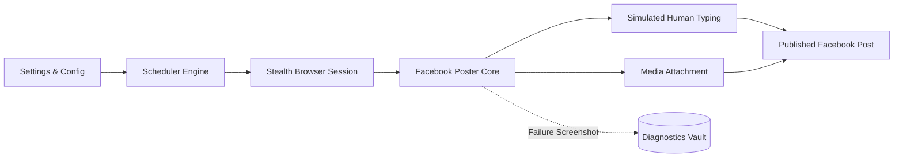

# ⚡ Facebook Automation Suite

<p align="center">
  
  
  
  
  
</p>

<p align="center">
  <strong>Enterprise-Grade, Anti-Detect Facebook Post Automation & Campaign Scheduling Engine.</strong><br>
  Built with Python & Playwright for high reliability, human-like stealth execution, and zero checkpoint interruptions.
</p>

---

## 🌟 Overview

The **Facebook Automation Suite** is a modular, production-ready framework built for growth marketers, social media managers, and agencies seeking reliable organic post automation on Facebook without risking account security.

Unlike basic scripting tools, this suite implements **humanized typing simulation**, **randomized action intervals**, **session cookie caching**, and **resilient selector fallbacks** to ensure smooth, unblocked execution.



---

## ✨ Key Features

- **🚀 Organic Post Publishing:** Publish text posts, formatted captions, and high-resolution images to personal feeds and business pages.
- **🛡️ Stealth Anti-Detection:** Strips `navigator.webdriver`, mimics natural human typing speeds (with micro-pauses), and applies non-linear delays.
- **🍪 Persistent Session Management:** Login once and store encrypted browser states. Avoids repetitive password inputs and 2FA interruptions.
- **⏰ Smart Campaign Scheduler:** Set up recurring daily posting queues (e.g., `09:00`, `14:30`) or interval-based triggers via declarative YAML config.
- **🌐 Proxy & Multi-Profile Ready:** Full support for rotating HTTP and SOCKS5 proxies for multi-account safety.
- **📸 Auto Diagnostic Capture:** Automatically generates debug screenshots and timestamped logs if an interface element changes.
- **💻 Beautiful Terminal Interface:** Interactive CLI powered by Rich with clear progress indicators and formatted logs.

---

## 💼 Custom Enterprise Inquiries & Client Work

> [!TIP]
> **Need Advanced Capabilities Tailored to Your Business?**
>
> This open-source repository contains the core **Post Automation Engine**. If you need custom enterprise features, specialized social tools, or full-funnel automation, I develop custom bespoke solutions:
>
> - 🤖 **AI-Powered Messenger Chatbots:** Natural language responses powered by OpenAI / Claude.
> - 💬 **Automated Comment Auto-Reply:** Real-time sentiment filtering and automatic customer lead generation.
> - 📊 **Audience & Group Member Scrapers:** Extract targeted public leads into CSV / Google Sheets.
> - 🔗 **CRM & Webhook Sync:** Connect Facebook events to Zapier, Make, Slack, Telegram, or HubSpot.
>
> **📬 Contact for Custom Projects & Freelance Inquiries:**
> - **Email:** [naimsmahmud50@gmail.com](mailto:naimsmahmud50@gmail.com)
> - **GitHub:** [@naimsmahmud50-dotcom](https://github.com/naimsmahmud50-dotcom)

---

## 📁 Project Architecture

```
Facebook-Automation-/
├── .github/workflows/          # CI/CD Automated Test Pipelines
├── config/
│   ├── .env.example            # Environment variables template
│   └── settings.example.yaml   # Campaign queues & timing configurations
├── src/
│   ├── core/
│   │   ├── browser.py          # Playwright stealth browser setup
│   │   ├── session.py          # Cookie & session persistence
│   │   └── scheduler.py        # Periodic & cron job scheduler
│   ├── modules/
│   │   └── poster.py           # Core Facebook post publishing engine
│   ├── utils/
│   │   ├── helpers.py          # Humanized typing & delay utilities
│   │   └── logger.py           # Colorized logging & file rotation
│   └── main.py                 # CLI entry point (Interactive & Headless)
├── examples/
│   ├── single_post_example.py  # Quickstart single post demonstration
│   └── scheduled_posts.py      # Background campaign runner demo
├── tests/
│   └── test_config.py          # Configuration and initialization tests
├── requirements.txt            # Python dependencies
├── pyproject.toml              # Modern package metadata
├── LICENSE                     # MIT License
└── README.md                   # Documentation & guide
```

---

## 🚀 Quickstart Guide

### 1. Prerequisites
- Python 3.10 or higher
- Git

### 2. Clone Repository
```bash
git clone https://github.com/naimsmahmud50-dotcom/Facebook-Automation-.git
cd Facebook-Automation-
```

### 3. Setup Virtual Environment
```bash
# Windows
python -m venv venv
venv\Scripts\activate

# macOS / Linux
python3 -m venv venv
source venv/bin/activate
```

### 4. Install Dependencies
```bash
pip install -r requirements.txt
playwright install chromium
```

### 5. Configure Credentials & Settings
Copy the example config templates:
```bash
cp config/.env.example .env
cp config/settings.example.yaml config/settings.yaml
```

Edit `.env` with your preferred settings:
```env
FB_EMAIL=your_email_here
FB_PASSWORD=your_password_here
HEADLESS=false
SLOW_MO_MS=120
```
*(Note: If you prefer manual browser login, launch once with `HEADLESS=false` to save your session cookies safely into `sessions/fb_session.json`.)*

---

## 🎮 Usage

### Option A: Interactive CLI Menu
Run the main controller with no arguments to enter the visual console:
```bash
python -m src.main
```

### Option B: Quick Single Post
Publish content directly from your command line:
```bash
python -m src.main --post "Accelerating productivity with smart automation! 🚀 #Growth"
```

Attach images:
```bash
python -m src.main --post "Check out our latest update!" --media "assets/banner.png"
```

### Option C: Run Scheduled Campaigns
Launch the continuous background campaign scheduler:
```bash
python -m src.main --schedule --config config/settings.yaml
```

---

## 🧪 Running Tests

Ensure all components and configurations pass tests:
```bash
pytest -v tests/
```

---

## ⚖️ Disclaimer & Safety Notice

This project is created for educational, research, and legitimate social media management purposes. Automating interactions on Facebook must comply with [Meta's Terms of Service](https://www.facebook.com/terms.php). Use responsibly with appropriate pacing and rate limits. The author is not responsible for any misuse or account actions taken by third-party platforms.

---

## 📄 License

Distributed under the **MIT License**. See [`LICENSE`](LICENSE) for more information.

<p align="center">
  Made with ❤️ by <strong><a href="https://github.com/naimsmahmud50-dotcom">Mahmud Hasan</a></strong>
</p>
